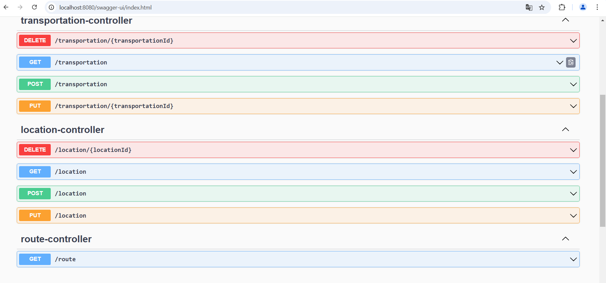

# SkyRoute

- An aviation web application.
- App user defines transportations and locations.
- Using routes page on UI all possible rotes from location A to B cen be detected.

# BE
- This project is BE of SkyRoute application.
- A rest API implemented with SpringBoot

#  FE
- You can reach FE of SkyRoute application from https://github.com/yusufarslanalp/SkyRoute-React

## Swagger UI

## Postman Collection
- https://github.com/yusufarslanalp/SkyRoute/blob/main/SkyRoute.postman_collection.json

